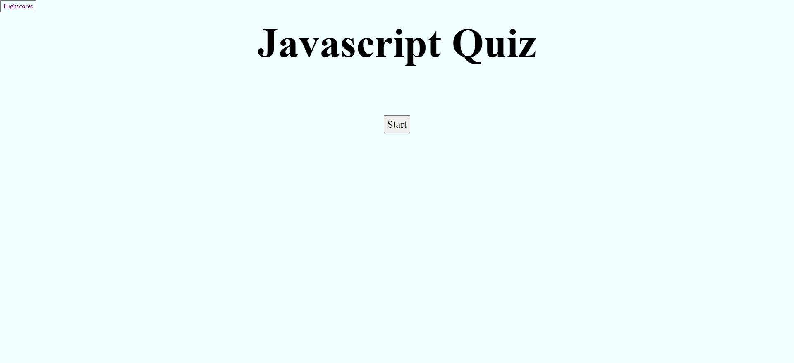
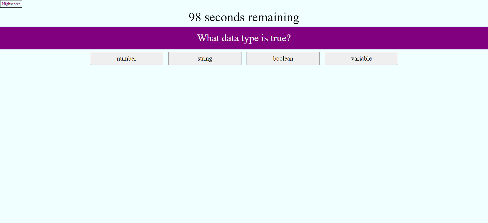
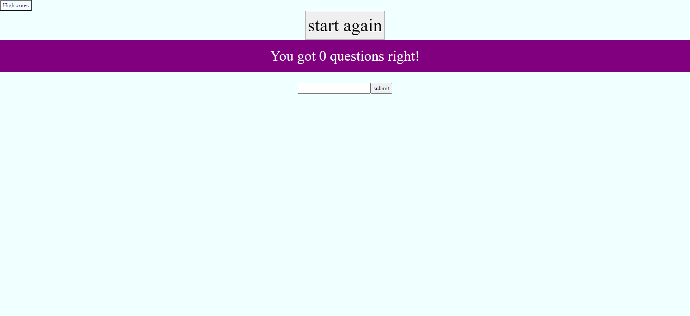

# Homework-4-Coding-Quiz

## Description
This is a web quiz that gives you a quiz on the fundamentals of Javascript. It will show how many questions you answered correctly then give you the option to save your score with your initials as a high score if you beat or meet the existing high score. It will also take time away if you answer the question incorrectly.

## Problems
I had problems trying to update my timer display when the user answered a question incorrectly. I also had some troubles with trying to validate the user chosen answer to the correct answer and incrementing the amount of questions they got right if they did. I also had some problems trying to prevent the generation of questions even though there are no more questions to be generated.

## Screenshot

## Webpage
[Javascript Quiz](https://echo1826.github.io/Homework-4-Coding-Quiz/)

## Credits
I want to thank my teacher Leah for explaining the topics used in this application and giving guidance on how to start this assignment.